# Báo cáo Thực hành: CRUD Operation

**Họ và tên:** Trần Quang Phát  
**MSSV:** 23521151  

---

## Bài 1.1: Thiết lập môi trường

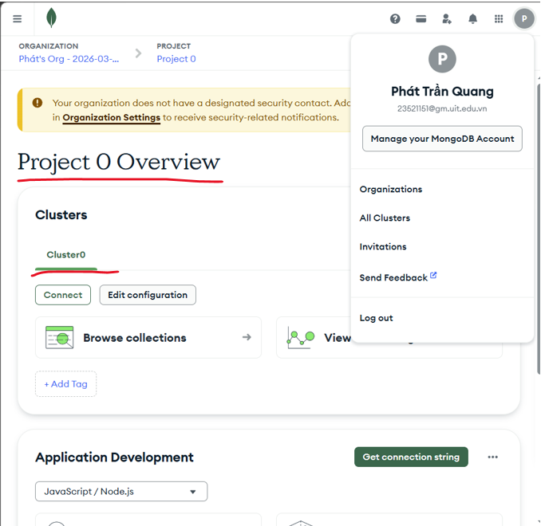

---

## Bài 1.2: Tìm nạp dữ liệu mẫu

Vào mục **Cluster**, chọn **Load Sample Dataset**.
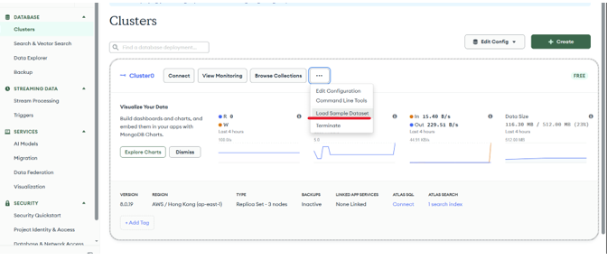
Sau đó qua tab **Data Explorer**, kết nối tới cluster — ta sẽ thấy các dữ liệu mẫu có tên là `sample_analytics` và `sample_mflix`.
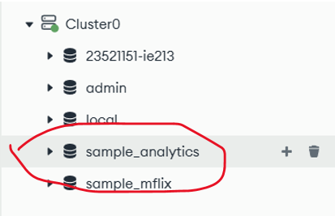
---

## Bài 1.3: Cài đặt MongoDB Compass

Về lại tab **Database**, nhấn **Connect** vào cluster đã tạo.
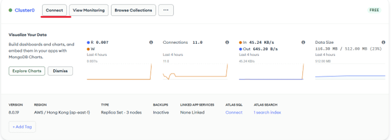

Chọn **Compass**, sau đó chọn **I don't have MongoDB Compass installed**, rồi nhấn tải Compass.

Giao diện **Compass**
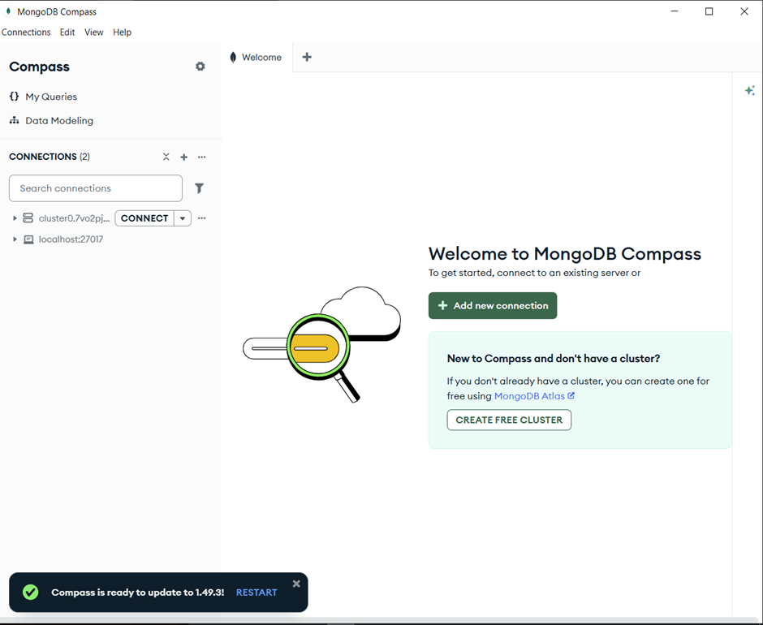
---

## Bài 1.4: Kết nối MongoDB Compass với cluster trên MongoDB Atlas
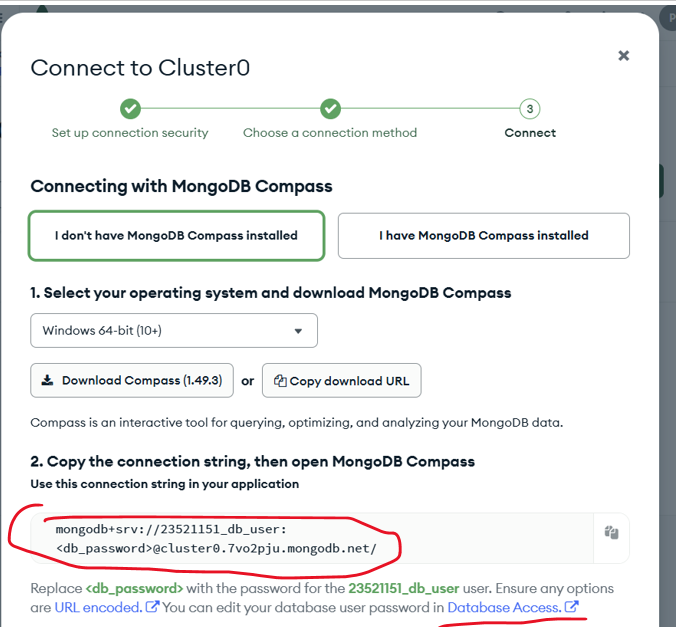
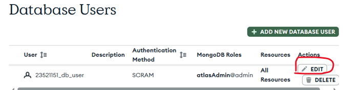
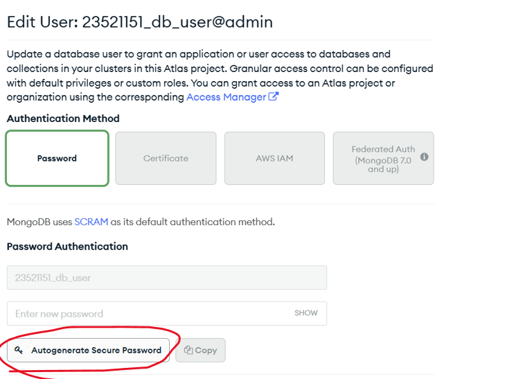
Sau khi **Autogenerate password**, tiến hành kết nối vào MongoDB Compass.
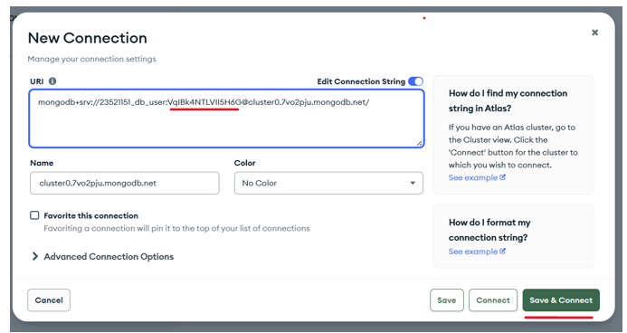
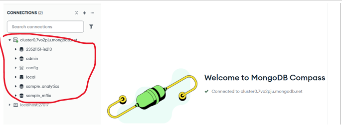
---

## Bài 2: Thực hành CRUD

### 2.1 Tạo cơ sở dữ liệu có tên MSSV-IE213 trên cluster

Tạo database mới với tên `23521151-IE213` trên cluster đã thiết lập.
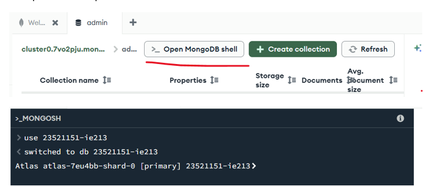

---

### 2.2 Thêm các document vào collection `employees`

Thêm nhiều document vào collection `employees` trong database vừa tạo.
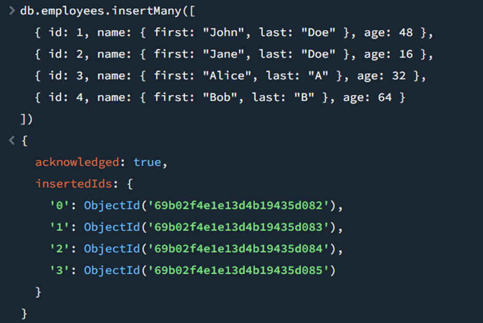

---

### 2.3 Đặt trường `id` trở thành duy nhất (Unique Index)

Tạo unique index trên trường `id` để đảm bảo không thể thêm document mới với giá trị `id` đã tồn tại.
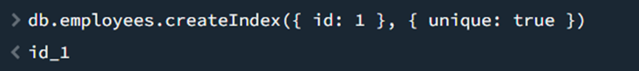
---

### 2.4 Tìm document có `firstname` là John và `lastname` là Doe

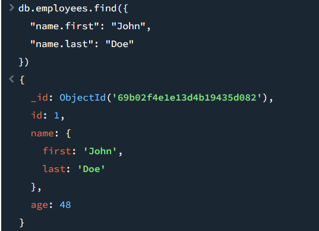

> `"name.first"` và `"name.last"` là **truy cập vào field lồng nhau (nested field)** trong object `name`.

---

### 2.5 Tìm người có tuổi trên 30 và dưới 60

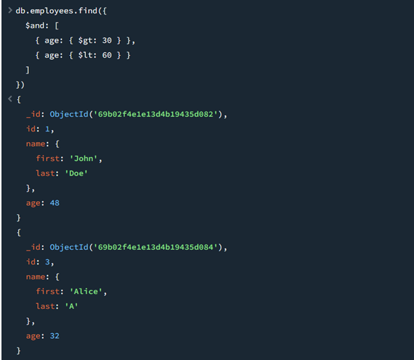

- `$gt` = **greater than** (lớn hơn)  
- `$lt` = **less than** (nhỏ hơn)

---

### 2.6 Thêm document mới và tìm tất cả document có `middle name`

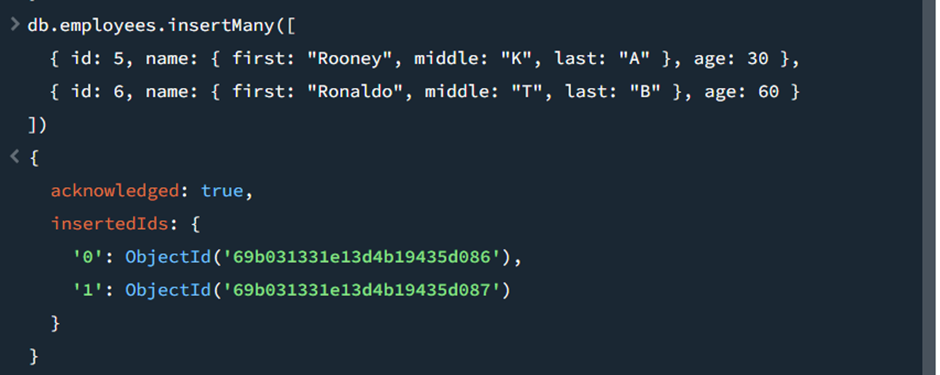
Tìm tất cả document có middle name
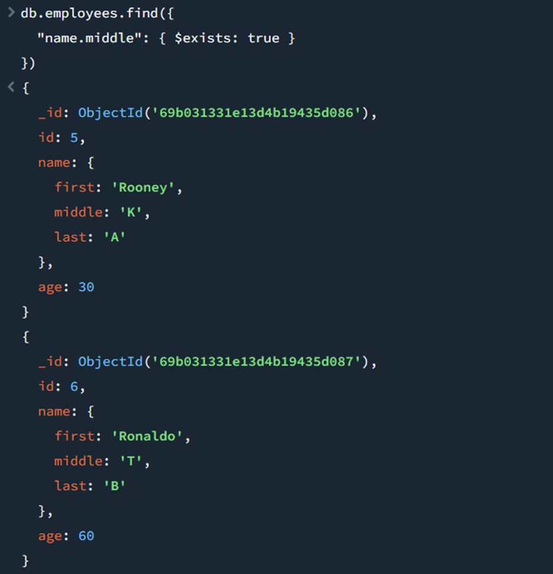

> `$exists: true` → tìm các document **có tồn tại field đó**.

---

### 2.7 Xóa `middle name` khỏi các document

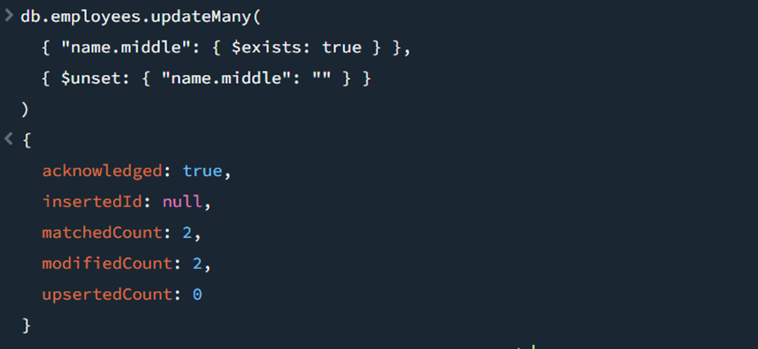

> `$unset` → **xóa field khỏi document**.

---

### 2.8 Thêm trường `organization = "UIT"` cho tất cả document
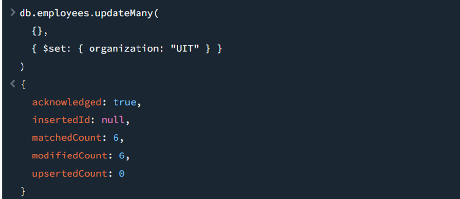

> `{}` nghĩa là **áp dụng cho toàn bộ document trong collection**.

---

### 2.9 Đổi `organization` của `id = 5` và `id = 6` thành "USSH"

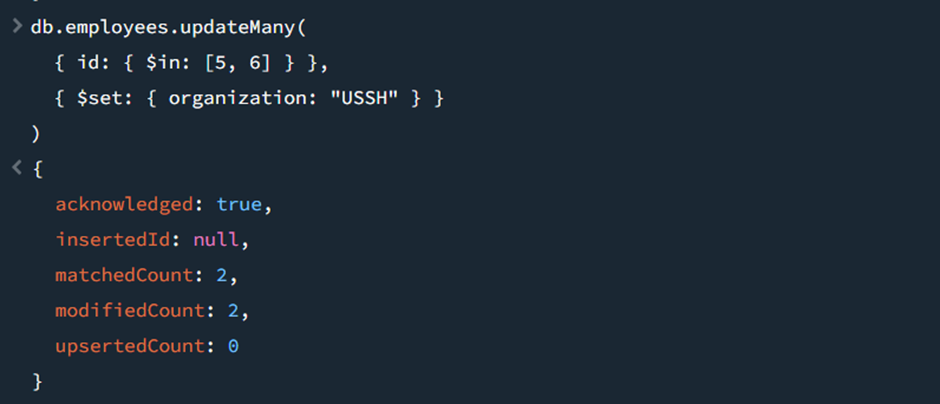

---

### 2.10 Tính tổng tuổi và tuổi trung bình theo `organization`

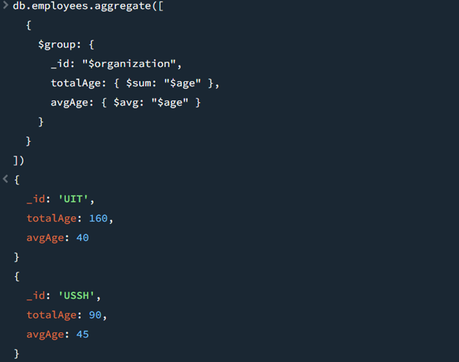

- `$group` → nhóm theo `organization`  
- `$sum` → tính **tổng tuổi**  
- `$avg` → tính **tuổi trung bình**