# Báo cáo Thực hành Lab 02: Thiết lập Backend & MongoDB DAO

**Họ và tên:** Trần Quang Phát  
**MSSV:** 23521151

---

## Bài 1: Thiết lập môi trường

### 1.1 Cài đặt Node.js và Công cụ soạn thảo

- Cài đặt Node.js từ [nodejs.org](https://nodejs.org).
- Sử dụng Visual Studio Code làm trình soạn thảo mã nguồn.

**Minh chứng:** Kiểm tra phiên bản node bằng lệnh `node -v`


 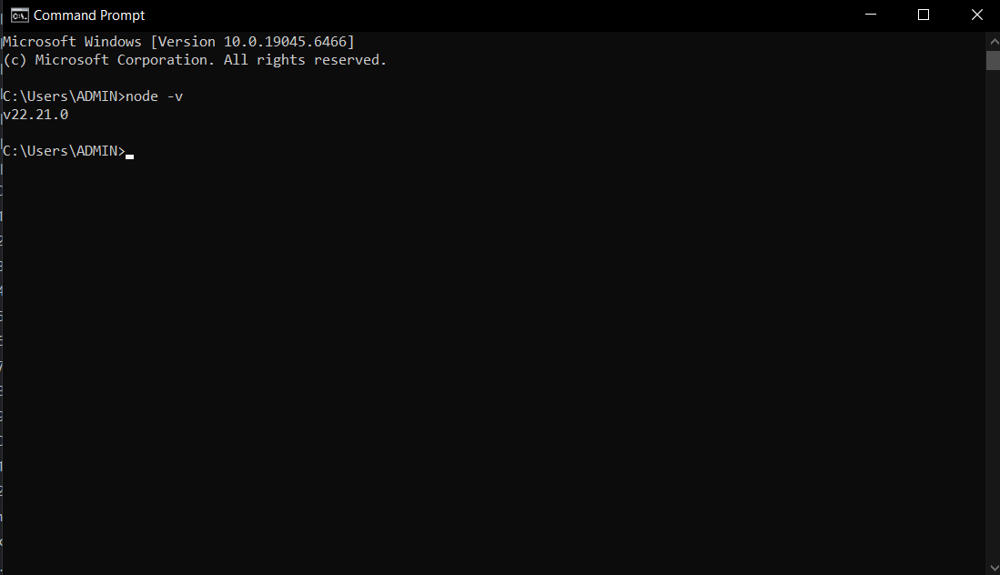
---

### 1.2 Cài đặt Extension cho Visual Studio Code

- Cài đặt các extension hỗ trợ phát triển như **ESLint**, **Prettier**, **MongoDB for VS Code**, v.v.

**Minh chứng:** Danh sách extension đã cài đặt trong VS Code.


   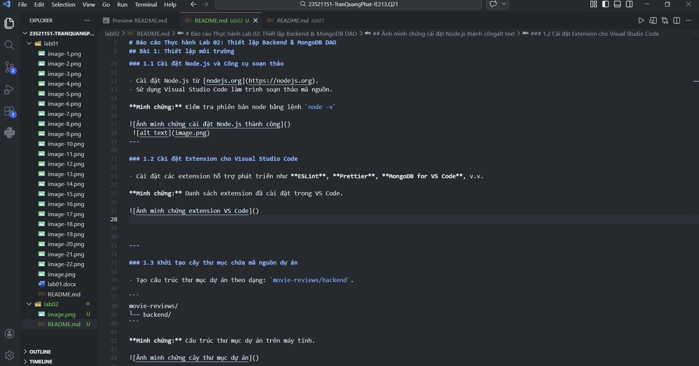


---

### 1.3 Khởi tạo cây thư mục chứa mã nguồn dự án

- Tạo cấu trúc thư mục dự án theo dạng: `movie-reviews/backend`.

```
movie-reviews/
└── backend/
```

**Minh chứng:** Cấu trúc thư mục dự án trên máy tính.


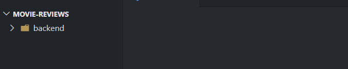
---

### 1.4 Khởi tạo dự án với `npm init`

- Mở terminal tại thư mục `backend`, chạy lệnh:

```bash
npm init
```

- Điền các thông tin cần thiết (tên dự án, version, entry point, ...) để tạo file `package.json`.

**Minh chứng:** File `package.json` được tạo sau khi chạy `npm init`.


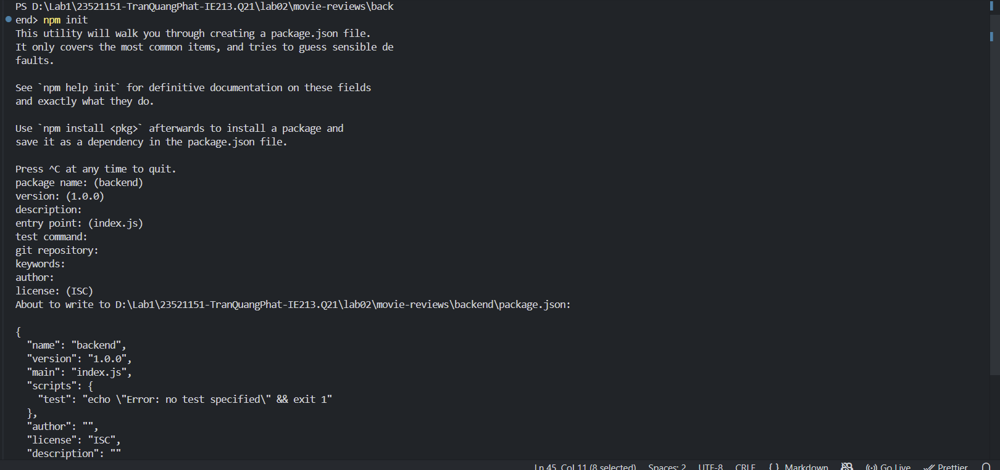

---

### 1.5 Cài đặt các dependency của dự án

- Cài đặt các thư viện cần thiết bằng lệnh:

```bash
npm install mongodb express cors dotenv
```

| Package   | Mô tả                                              |
|-----------|----------------------------------------------------|
| `mongodb` | Driver kết nối với MongoDB                         |
| `express` | Framework xây dựng REST API                        |
| `cors`    | Middleware cho phép Cross-Origin Resource Sharing  |
| `dotenv`  | Đọc biến môi trường từ file `.env`                 |

**Minh chứng:** Phần `dependencies` trong `package.json` sau khi cài đặt.


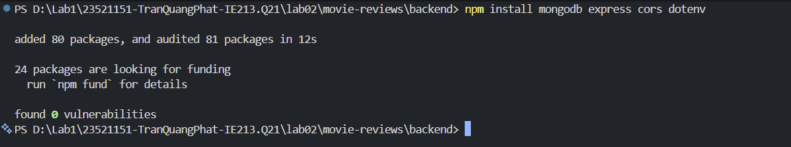
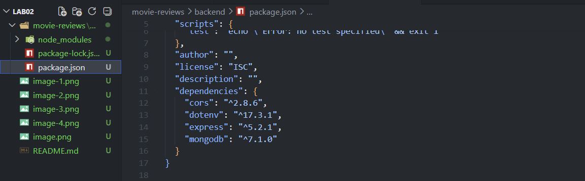
---

### 1.6 Cài đặt `nodemon`

- `nodemon` là công cụ giúp tự động khởi động lại máy chủ web khi có sự thay đổi về mã nguồn, hỗ trợ quá trình phát triển nhanh hơn.
- Cài đặt `nodemon` như một dev dependency:

```bash
npm install --save-dev nodemon
```

- Thêm script vào `package.json` để chạy server với `nodemon`:

```json
"scripts": {
  "dev": "nodemon index.js"
}
```

**Minh chứng:** Phần `devDependencies` và `scripts` trong `package.json`.


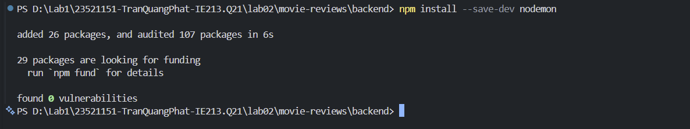
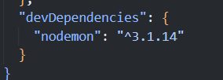
---

## Bài 2: Xây dựng Backend và kết nối Dữ liệu

### 2.1 Cấu hình biến môi trường (`.env`) và Server cơ bản

- Tạo file `.env` lưu trữ URI kết nối MongoDB Atlas và PORT (3000).
- Thiết lập `server.js` với Express, CORS và các middleware xử lý lỗi 404.

**Minh chứng:** Nội dung file `.env` và `server.js`.


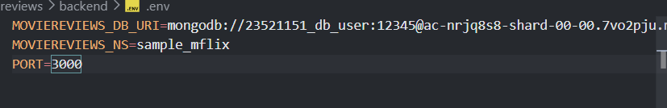
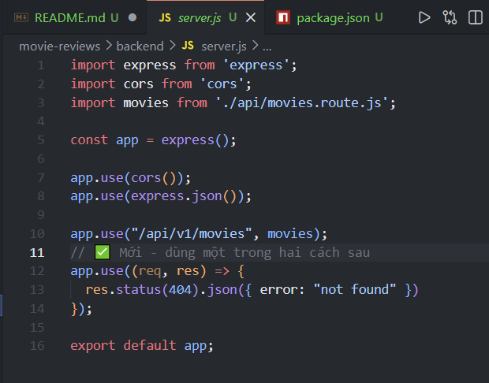

---

### 2.2 Kết nối Database và Khởi chạy (`index.js`)

- Sử dụng `index.js` để kết nối tới MongoDB Atlas.
- Chỉ khi kết nối thành công mới bắt đầu lắng nghe (listen) cổng của server.

**Minh chứng:** Terminal hiển thị thông báo kết nối DB thành công.


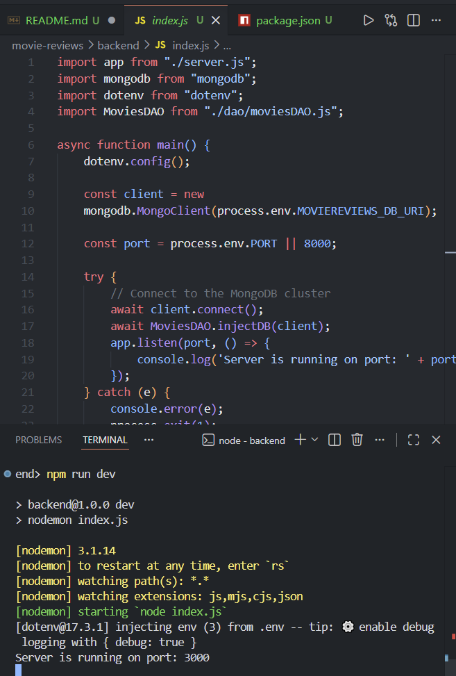
---

### 2.3 Thiết lập Routing (`movies.route.js`)

- Tạo định tuyến tại đường dẫn `/api/v1/movies`.
- Thử nghiệm ban đầu trả về chuỗi `"hello world"`.

**Minh chứng:** Truy cập `localhost:3000/api/v1/movies` trên trình duyệt.


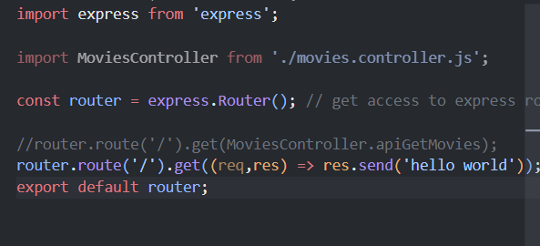
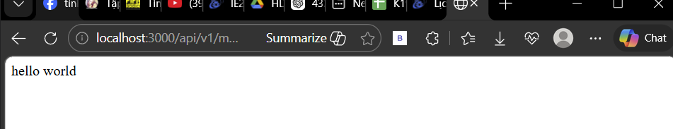
---

### 2.4 Thiết lập Data Access Object (`MoviesDAO`)

- Tạo `moviesDAO.js` để tách biệt logic truy vấn dữ liệu.
- `injectDB()`: Tham chiếu tới collection `movies` của database `sample_mflix`.
- `getMovies()`: Truy vấn danh sách phim với phân trang (mặc định 20 phim/trang).

**Minh chứng:** Cấu trúc file `moviesDAO.js`.


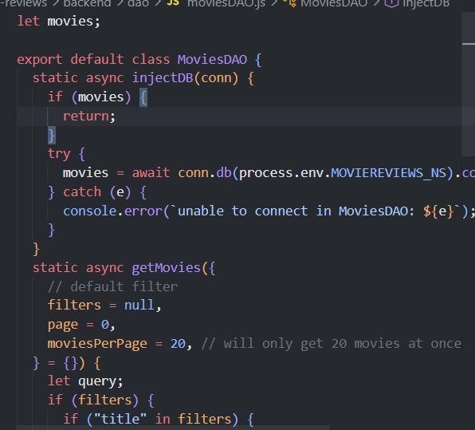
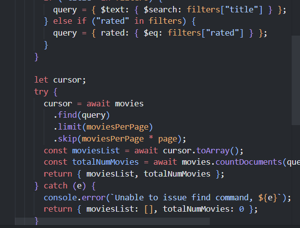
---

### 2.5 Thiết lập Controller (`movies.controller.js`)

- Tạo `MoviesController` để tiếp nhận yêu cầu từ Route và gọi hàm từ DAO.
- Hàm `apiGetMovies()` xử lý query parameters và trả về định dạng JSON cho client.

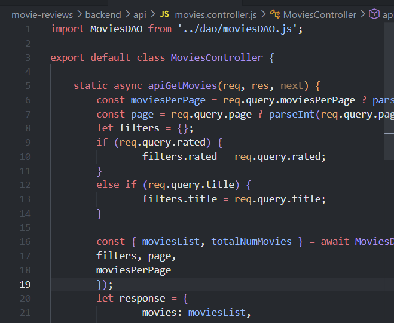
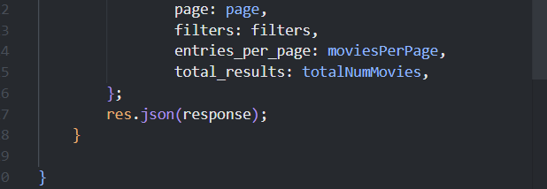
---


### 2.6 Kết quả cuối cùng

Kết nối thành công giữa **Route → Controller → DAO** và trả về dữ liệu thực tế từ MongoDB Atlas.

**Minh chứng:** Kết quả JSON danh sách phim hiển thị trên trình duyệt.


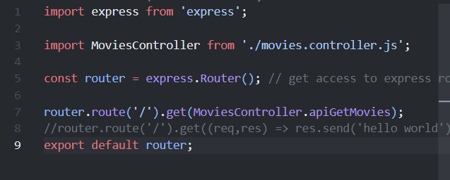
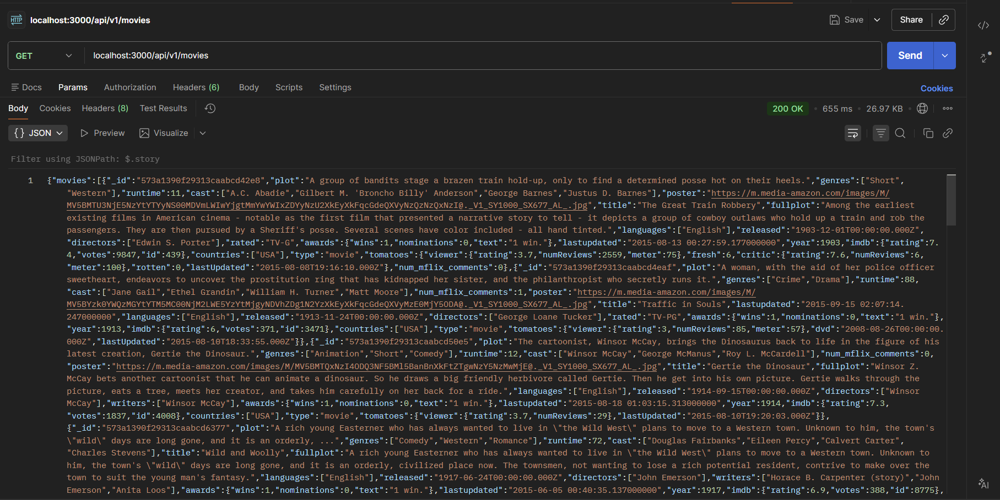