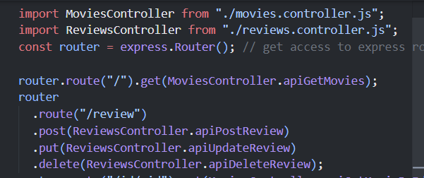
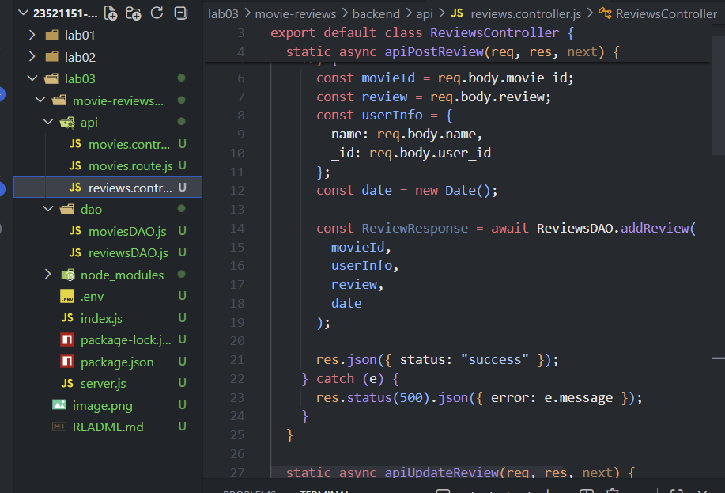
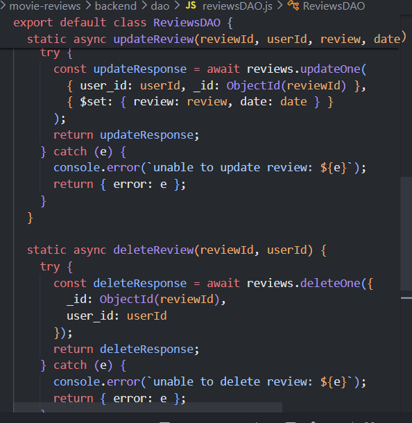
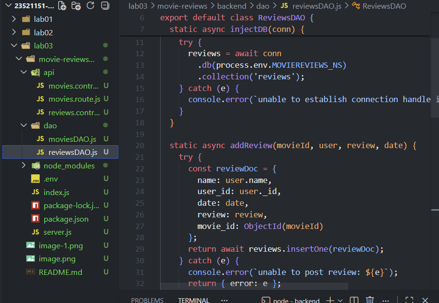
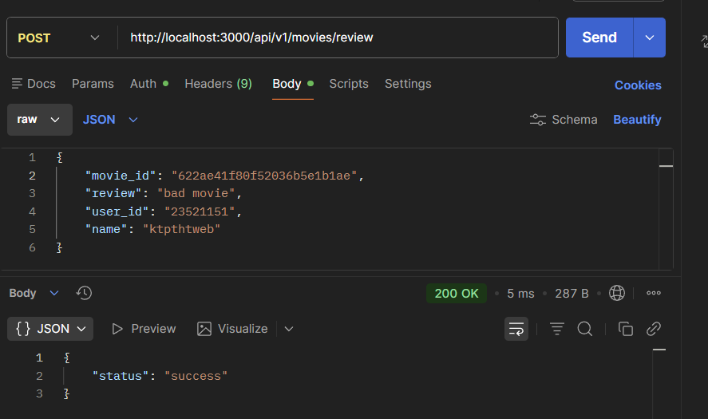
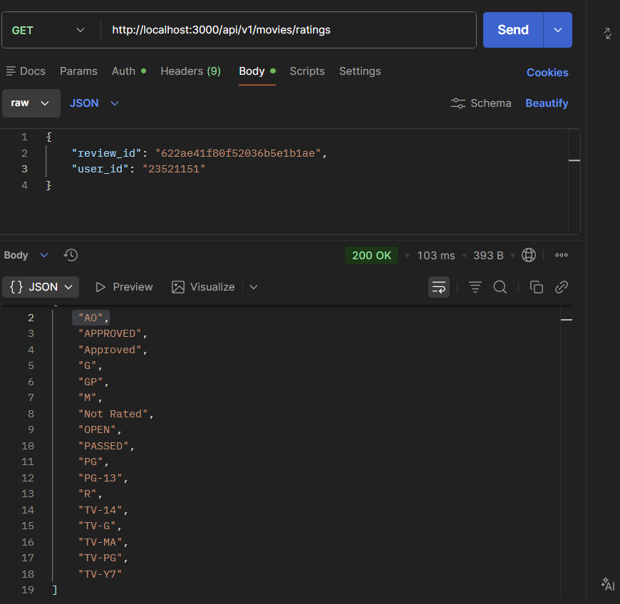

# BÁO CÁO BÀI THỰC HÀNH 3

## Hoàn Thiện Back-End Cho Ứng Dụng Minh Hoạ (Movies Review)

**Môn học:** Kỹ Thuật Phát Triển Hệ Thống Web  
**Biên soạn:** ThS. Võ Tấn Khoa  
**Ngày nộp:** [7/4/2026]  
**Sinh viên:** [Trần Quang Phát - 23521151]

---

## 📋 MỤC LỤC

1. [Mô tả bài thực hành](#mô-tả-bài-thực-hành)
2. [Yêu cầu thực hiện](#yêu-cầu-thực-hiện)
3. [Chi tiết từng bài](#chi-tiết-từng-bài)
4. [Kết quả thực hiện](#kết-quả-thực-hiện)
5. [Hình ảnh minh chứng](#hình-ảnh-minh-chứng)
6. [Kết luận](#kết-luận)

---

## 📖 MỤ TẢ BÀI THỰC HÀNH

Bài thực hành 3 yêu cầu xây dựng hoàn chỉnh back-end API cho ứng dụng quản lý review phim, bao gồm:

- Thiết lập định tuyến (routing) cho các thao tác với review
- Tạo Controller để xử lý các yêu cầu từ client
- Tạo DAO để tương tác với MongoDB
- Hoàn thiện các API liên quan đến phim và rating

**Stack công nghệ:**

- Node.js + Express.js
- MongoDB
- MongoDB Driver
- REST API Architecture

---

## ✅ YÊU CẦU THỰC HIỆN

| Bài       | Tiêu đề                         | Trạng thái   |
| --------- | ------------------------------- | ------------ |
| **Bài 1** | Thiết lập định tuyến cho review | ☐ Hoàn thành |
| **Bài 2** | Tạo ReviewsController           | ☐ Hoàn thành |
| **Bài 3** | Tạo ReviewsDAO                  | ☐ Hoàn thành |
| **Bài 4** | Hoàn thiện back-end với API mới | ☐ Hoàn thành |

---

## 🔧 CHI TIẾT TỪNG BÀI

### **BÀI 1: Thiết lập định tuyến cho review**

#### Mục tiêu:

Thiết lập các route (đường dẫn) để xử lý các thao tác CRUD (Create, Read, Update, Delete) cho review trong tệp `movies.router.js`

#### Yêu cầu chi tiết:

**1.1** - Định tuyến có đường dẫn cuối cùng là `/review`

- URL: `localhost:3000/api/v1/movies/review`

**1.2** - Định tuyến POST để thêm review

- Phương thức: `POST`
- Gọi tới: `ReviewsController.apiPostReview()`

**1.3** - Định tuyến PUT để sửa review

- Phương thức: `PUT`
- Gọi tới: `ReviewsController.apiUpdateReview()`

**1.4** - Định tuyến DELETE để xoá review

- Phương thức: `DELETE`
- Gọi tới: `ReviewsController.apiDeleteReview()`

#### Code thực hiện:

```javascript
import express from "express";
import MoviesController from "./movies.controller.js";
import ReviewsController from "./reviews.controller.js";

const router = express.Router();

router.route("/").get(MoviesController.apiGetMovies);

router
  .route("/review")
  .post(ReviewsController.apiPostReview)
  .put(ReviewsController.apiUpdateReview)
  .delete(ReviewsController.apiDeleteReview);

export default router;
```

#### Hình ảnh minh chứng:

> 

---

### **BÀI 2: Thiết lập Controller cho review**

#### Mục tiêu:

Tạo file `reviews.controller.js` chứa class `ReviewsController` để quản lý các yêu cầu từ client liên quan đến review

#### Yêu cầu chi tiết:

**2.1** - Tạo tệp `reviews.controller.js` trong thư mục `api`

- Tạo class: `ReviewsController`
- Vị trí: `./api/reviews.controller.js`

**2.2** - Import ReviewsDAO

- Nhập content từ `reviewsDAO.js` (tạo ở bài 3)

**2.3** - Tạo phương thức `apiPostReview()`

- Lấy dữ liệu từ `req.body`: `movie_id`, `review`, `name`, `user_id`
- Tạo biến `date` lưu ngày hiện tại
- Gọi hàm `ReviewsDAO.addReview()`
- Trả về JSON `{status: "success"}` nếu thành công
- Log lỗi nếu thất bại

**2.4** - Tạo phương thức `apiUpdateReview()`

- Lấy dữ liệu: `review_id`, `user_id`, `review`
- Tạo biến `date` lưu ngày hiện tại
- Gọi hàm `ReviewsDAO.updateReview()`
- Kiểm tra `modifiedCount` để xác định có review nào được sửa không
- Trả về JSON `{status: "success"}` nếu thành công

**2.5** - Tạo phương thức `apiDeleteReview()`

- Lấy dữ liệu: `review_id`, `user_id`
- Gọi hàm `ReviewsDAO.deleteReview()`
- Trả về JSON `{status: "success"}` nếu thành công

#### Code thực hiện:

```javascript
import ReviewsDAO from "../dao/reviewsDAO.js";

export default class ReviewsController {
  static async apiPostReview(req, res, next) {
    try {
      const movieId = req.body.movie_id;
      const review = req.body.review;
      const userInfo = {
        name: req.body.name,
        _id: req.body.user_id,
      };
      const date = new Date();

      const ReviewResponse = await ReviewsDAO.addReview(
        movieId,
        userInfo,
        review,
        date,
      );

      res.json({ status: "success" });
    } catch (e) {
      res.status(500).json({ error: e.message });
    }
  }

  static async apiUpdateReview(req, res, next) {
    try {
      const reviewId = req.body.review_id;
      const review = req.body.review;
      const date = new Date();

      const ReviewResponse = await ReviewsDAO.updateReview(
        reviewId,
        req.body.user_id,
        review,
        date,
      );

      var { error } = ReviewResponse;
      if (error) {
        res.status(400).json({ error });
      }
      if (ReviewResponse.modifiedCount === 0) {
        throw new Error(
          "unable to update review. User may not be original poster",
        );
      }

      res.json({ status: "success" });
    } catch (e) {
      res.status(500).json({ error: e.message });
    }
  }

  static async apiDeleteReview(req, res, next) {
    try {
      const reviewId = req.body.review_id;
      const userId = req.body.user_id;

      const ReviewResponse = await ReviewsDAO.deleteReview(reviewId, userId);

      res.json({ status: "success" });
    } catch (e) {
      res.status(500).json({ error: e.message });
    }
  }
}
```

#### Hình ảnh minh chứng:

> 

---

### **BÀI 3: Thiết lập DAO cho reviews**

#### Mục tiêu:

Tạo file `reviewsDAO.js` chứa class `ReviewsDAO` để tương tác trực tiếp với collection `reviews` trong MongoDB

#### Yêu cầu chi tiết:

**3.1** - Tạo file `reviewsDAO.js` trong thư mục `dao`

- Import package `mongodb`
- Tạo hằng số `ObjectId = mongodb.ObjectId`
- Tạo biến `reviews` để tham chiếu collection

**3.2** - Tạo phương thức `injectDB(conn)`

- Kết nối tới collection `reviews` trong database
- Gọi phương thức này trong `index.js` sau khi kết nối MongoDB
- Thực hiện TRƯỚC khi khởi tạo server

**3.3** - Tạo phương thức `addReview()`

- Tham số: `movieId`, `user`, `review`, `date`
- Tạo object `reviewDoc` chứa: `name`, `user_id`, `date`, `review`, `movie_id`
- Chuyển đổi `movieId` thành `ObjectId`
- Gọi `insertOne()` để thêm vào database

**3.4** - Tạo phương thức `updateReview()`

- Tham số: `reviewId`, `userId`, `review`, `date`
- Chuyển đổi `reviewId` thành `ObjectId`
- Điều kiện: `user_id` phải khớp mới cho phép sửa
- Gọi `updateOne()` để cập nhật dữ liệu

**3.5** - Tạo phương thức `deleteReview()`

- Tham số: `reviewId`, `userId`
- Chuyển đổi `reviewId` thành `ObjectId`
- Điều kiện: `user_id` phải khớp mới cho phép xoá
- Gọi `deleteOne()` để xoá dữ liệu

**3.6** - Thử nghiệm API bằng Insomnia

- Lưu ý: Thay `user_id` bằng `MSSV`

#### Code thực hiện:

```javascript
import mongodb from "mongodb";

const ObjectId = mongodb.ObjectId;
let reviews;

export default class ReviewsDAO {
  static async injectDB(conn) {
    if (reviews) {
      return;
    }
    try {
      reviews = await conn
        .db(process.env.MOVIEREVIEWS_NS)
        .collection("reviews");
    } catch (e) {
      console.error(`unable to establish connection handle in reviewDAO: ${e}`);
    }
  }

  static async addReview(movieId, user, review, date) {
    try {
      const reviewDoc = {
        name: user.name,
        user_id: user._id,
        date: date,
        review: review,
        movie_id: ObjectId(movieId),
      };
      return await reviews.insertOne(reviewDoc);
    } catch (e) {
      console.error(`unable to post review: ${e}`);
      return { error: e };
    }
  }

  static async updateReview(reviewId, userId, review, date) {
    try {
      const updateResponse = await reviews.updateOne(
        { user_id: userId, _id: ObjectId(reviewId) },
        { $set: { review: review, date: date } },
      );
      return updateResponse;
    } catch (e) {
      console.error(`unable to update review: ${e}`);
      return { error: e };
    }
  }

  static async deleteReview(reviewId, userId) {
    try {
      const deleteResponse = await reviews.deleteOne({
        _id: ObjectId(reviewId),
        user_id: userId,
      });
      return deleteResponse;
    } catch (e) {
      console.error(`unable to delete review: ${e}`);
      return { error: e };
    }
  }
}
```

#### Cập nhật file `index.js`:

```javascript
import app from "./server.js";
import mongodb from "mongodb";
import dotenv from "dotenv";
import MoviesDAO from "./dao/moviesDAO.js";
import ReviewsDAO from "./dao/reviewsDAO.js";

dotenv.config();
const MongoClient = mongodb.MongoClient;

const client = new MongoClient(process.env.MONGO_URI);
const port = process.env.PORT || 8000;

async function main() {
  try {
    // Connect to the MongoDB cluster
    await client.connect();
    await MoviesDAO.injectDB(client);
    await ReviewsDAO.injectDB(client);

    app.listen(port, () => {
      console.log("Server is running on port: " + port);
    });
  } catch (e) {
    console.error(e);
    process.exit(1);
  }
}

main().catch(console.error);
```

#### Hình ảnh minh chứng:

> 
> 



---

### **BÀI 4: Hoàn thiện back-end cho ứng dụng minh hoạ**

#### Mục tiêu:

Thêm 2 API mới để lấy thông tin chi tiết phim và danh sách rating

#### Yêu cầu chi tiết:

**4.1** - Thêm 2 định tuyến mới trong `movies.router.js`

1. **GET /id/:id** - Lấy thông tin phim và reviews liên quan
   - URL: `localhost:3000/api/v1/movies/id/[movie_id]`
   - Gọi: `MoviesController.apiGetMovieById()`

2. **GET /ratings** - Lấy tất cả loại rating
   - URL: `localhost:3000/api/v1/movies/ratings`
   - Gọi: `MoviesController.apiGetRatings()`

**4.2** - Thêm 2 phương thức Controller mới

- `apiGetMovieById(req, res, next)` - Lấy thông tin phim theo ID
- `apiGetRatings(req, res, next)` - Lấy danh sách các rating

**4.3** - Thêm 2 phương thức DAO mới

- `getMovieById(id)` - Sử dụng `$match`, `$lookup` và `aggregate()`
- `getRatings()` - Sử dụng `distinct()` để lấy các giá trị rating duy nhất

**4.4** - Thử nghiệm các API mới

#### Code thực hiện:

**movies.router.js:**

```javascript
router.route("/").get(MoviesController.apiGetMovies);

router
  .route("/review")
  .post(ReviewsController.apiPostReview)
  .put(ReviewsController.apiUpdateReview)
  .delete(ReviewsController.apiDeleteReview);

router.route("/id/:id").get(MoviesController.apiGetMovieById);
router.route("/ratings").get(MoviesController.apiGetRatings);

export default router;
```

**Thêm vào movies.controller.js:**

```javascript
static async apiGetMovieById(req, res, next) {
  try {
    let id = req.params.id || {};
    let movie = await MoviesDAO.getMovieById(id);

    if (!movie) {
      res.status(404).json({ error: "not found" });
      return;
    }

    res.json(movie);
  } catch (e) {
    console.log(`api, ${e}`);
    res.status(500).json({ error: e });
  }
}

static async apiGetRatings(req, res, next) {
  try {
    let ratings = await MoviesDAO.getRatings();
    res.json(ratings);
  } catch (e) {
    console.log(`api,${e}`);
    res.status(500).json({ error: e });
  }
}
```

**Thêm vào moviesDAO.js:**

```javascript
static async getMovieById(id) {
  try {
    return await movies.aggregate([
      {
        $match: { _id: new ObjectId(id) }
      },
      {
        $lookup: {
          from: 'reviews',
          localField: '_id',
          foreignField: 'movie_id',
          as: 'reviews'
        }
      }
    ]).next();
  } catch (e) {
    console.error(`something went wrong in getMovieById: ${e}`);
    throw e;
  }
}

static async getRatings() {
  let ratings = [];
  try {
    ratings = await movies.distinct("rated");
    return ratings;
  } catch (e) {
    console.error(`unable to get ratings, ${e}`);
    return ratings;
  }
}
```

#### Hình ảnh minh chứng:

> 


---

## 📊 KẾT QUẢ THỰC HIỆN

### Tóm tắt hoàn thành:

| Bài       | Yêu cầu           | Mô tả                                                          | Trạng thái |
| --------- | ----------------- | -------------------------------------------------------------- | ---------- |
| **Bài 1** | Routes cho review | Thiết lập POST, PUT, DELETE /review                            | ✅         |
| **Bài 2** | ReviewsController | 3 phương thức: apiPostReview, apiUpdateReview, apiDeleteReview | ✅         |
| **Bài 3** | ReviewsDAO        | injectDB, addReview, updateReview, deleteReview + thử nghiệm   | ✅         |
| **Bài 4** | API mới           | apiGetMovieById, apiGetRatings + getMovieById, getRatings      | ✅         |

### Công nghệ sử dụng:

- ✅ Express.js Router
- ✅ Controller pattern
- ✅ DAO pattern
- ✅ MongoDB operators: `$match`, `$lookup`, `$set`
- ✅ MongoDB methods: `insertOne()`, `updateOne()`, `deleteOne()`, `aggregate()`, `distinct()`
- ✅ Error handling với try-catch
- ✅ REST API HTTP methods: GET, POST, PUT, DELETE

### Lỗi gặp phải và cách khắc phục:

> **[Mô tả các lỗi gặp phải (nếu có) và cách khắc phục]**
Chưa xử lý được 1 số API put, delete của reviewsAPI, /id/:id của apiGetMovieById
Đang tìm cách khắc phục


---

## 📝 KẾT LUẬN

Bài thực hành 3 đã hoàn thành toàn bộ yêu cầu:

1. **Bài 1:** Thiết lập đầy đủ các route cho các thao tác CRUD với review
2. **Bài 2:** Tạo Controller để xử lý các yêu cầu từ client với proper error handling
3. **Bài 3:** Tạo DAO để tương tác với MongoDB, sử dụng ObjectId conversion và điều kiện kiểm tra owner
4. **Bài 4:** Hoàn thiện API với khả năng lấy thông tin chi tiết phim kèm review và danh sách rating

### Kiến thức thu được:

- ✅ Cách thiết lập routing trong Express.js
- ✅ Cách tổ chức Controller-DAO pattern
- ✅ Cách sử dụng MongoDB operators như `$match`, `$lookup`
- ✅ Cách sử dụng `aggregate()` để tổng hợp dữ liệu từ nhiều collection
- ✅ Cách sử dụng `distinct()` để lấy dữ liệu duy nhất
- ✅ Cách xử lý lỗi và trả về response phù hợp
