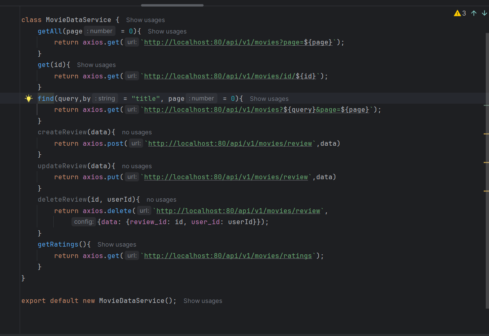
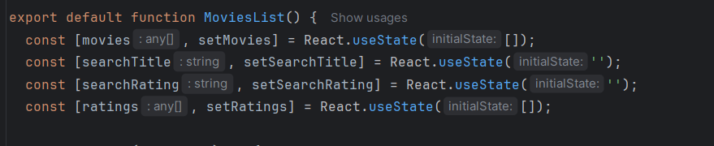
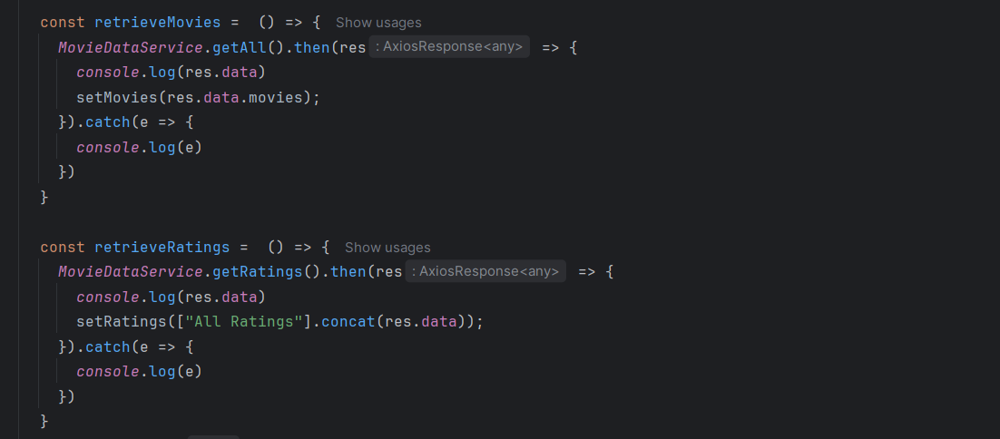
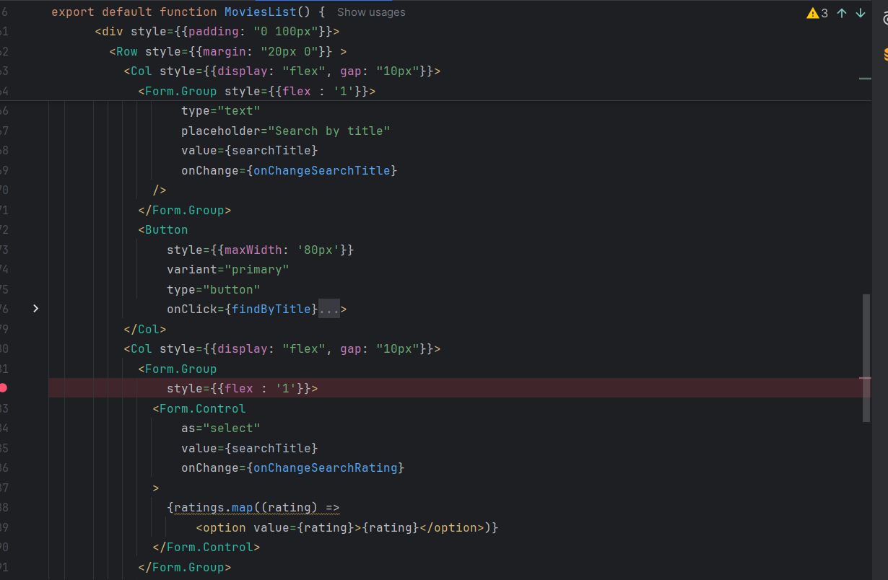
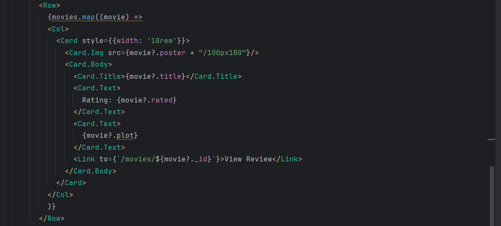
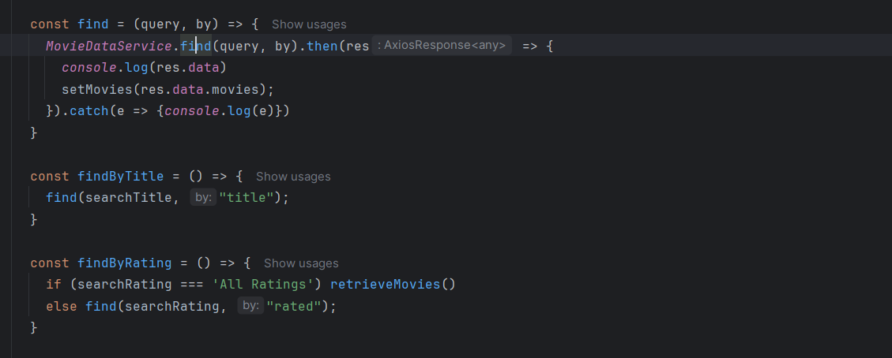
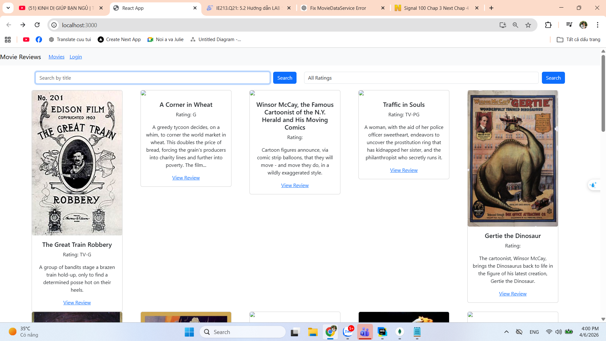
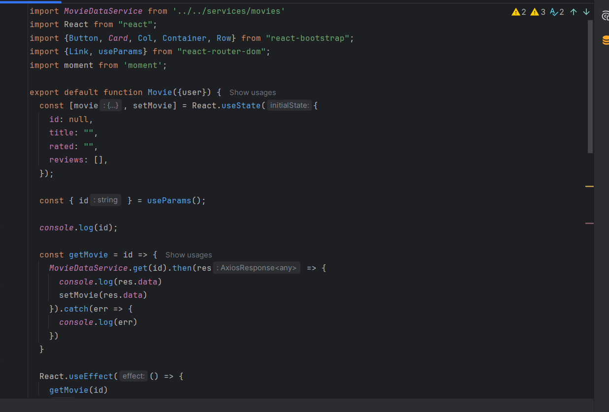
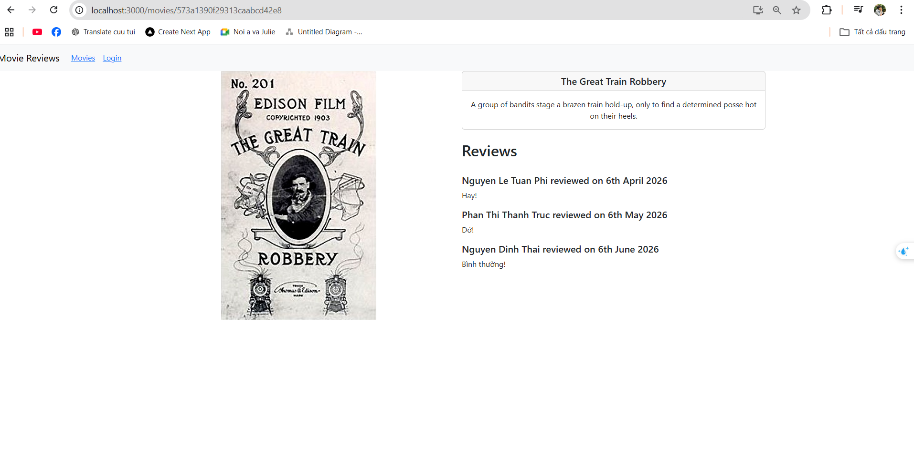
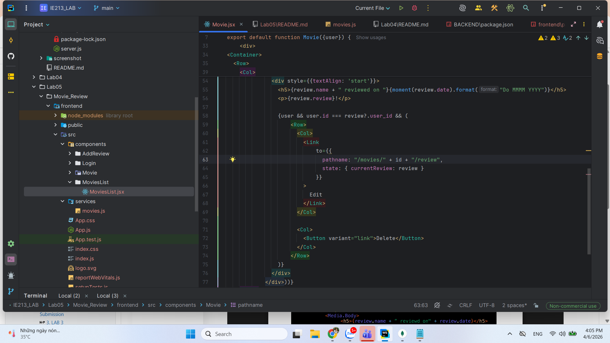

# Hướng dẫn Bài Thực Hành 5: Xây dựng Frontend với ReactJS

## 📋 Mục tiêu bài thực hành

1. Kết nối tới Backend sử dụng Axios
2. Xây dựng MovieList Component với tính năng tìm kiếm
3. Hiển thị thông tin chi tiết phim khi nhấn "View Reviews"
4. Hiển thị danh sách reviews tương ứng cho từng phim

---

## 🛠️ Công cụ / Môi trường sử dụng

- **Trình soạn thảo:** WebStorm (hoặc VS Code)
- **Package Manager:** npm
- **Thư viện chính:** React, Axios, React-Bootstrap, Moment.js
- **Backend:** Node.js/Express (localhost:80)

---

## 📝 Chi tiết bài làm

### Bài 1: Kết nối tới Backend

#### 1.1 Cài đặt Axios
```bash
npm install axios
```

#### 1.2 Tạo MovieDataService
**Vị trí file:** `src/services/movies.js`

Tạo lớp dịch vụ để quản lý tất cả các API calls tới backend:

```javascript
import axios from "axios";

class MovieDataService {
  getAll(page = 0) {
    return axios.get(`http://localhost:80/api/v1/movies?page=${page}`);
  }

  get(id) {
    return axios.get(`http://localhost:80/api/v1/movies/id/${id}`);
  }

  find(query, by = "title", page = 0) {
    return axios.get(
      `http://localhost:80/api/v1/movies?${by}=${query}&page=${page}`
    );
  }

  createReview(data) {
    return axios.post("http://localhost:80/api/v1/movies/review", data);
  }

  updateReview(data) {
    return axios.put("http://localhost:80/api/v1/movies/review", data);
  }

  deleteReview(id, userId) {
    return axios.delete("http://localhost:80/api/v1/movies/review", {
      data: { review_id: id, user_id: userId }
    });
  }

  getRatings() {
    return axios.get("http://localhost:80/api/v1/movies/ratings");
  }
}

export default new MovieDataService();
```

#### 1.3 Các phương thức API
- `getAll(page)` - Lấy danh sách phim (có phân trang)
- `get(id)` - Lấy chi tiết một phim theo ID
- `find(query, by, page)` - Tìm kiếm phim theo title hoặc rating
- `createReview(data)` - Tạo review mới
- `updateReview(data)` - Cập nhật review
- `deleteReview(id, userId)` - Xóa review
- `getRatings()` - Lấy danh sách các rating có sẵn



---

### Bài 2: Xây dựng MoviesList Component

#### 2.1 Tạo các biến trạng thái (State)
```javascript
import { useState, useEffect } from 'react';

const MoviesList = props => {
  const [movies, setMovies] = useState([]);
  const [searchTitle, setSearchTitle] = useState("");
  const [searchRating, setSearchRating] = useState("");
  const [ratings, setRatings] = useState([]);
  
  // ... code component
};
```



#### 2.2 Lấy dữ liệu từ Backend

Tạo 2 phương thức để lấy danh sách phim và ratings, gọi trong `useEffect()`:

```javascript
useEffect(() => {
  retrieveMovies();
  retrieveRatings();
}, []);

const retrieveMovies = () => {
  MovieDataService.getAll()
    .then(response => {
      console.log(response.data);
      setMovies(response.data.movies);
    })
    .catch(e => {
      console.log(e);
    });
};

const retrieveRatings = () => {
  MovieDataService.getRatings()
    .then(response => {
      console.log(response.data);
      setRatings(["All Ratings"].concat(response.data));
    })
    .catch(e => {
      console.log(e);
    });
};
```



#### 2.3 Xử lý thay đổi input

Tạo các handler cho tìm kiếm:

```javascript
const onChangeSearchTitle = e => {
  const searchTitle = e.target.value;
  setSearchTitle(searchTitle);
};

const onChangeSearchRating = e => {
  const searchRating = e.target.value;
  setSearchRating(searchRating);
};
```



#### 2.4 Tạo Search Form

```jsx
<Row>
  <Col>
    <Form.Group>
      <Form.Control
        type="text"
        placeholder="Search by title"
        value={searchTitle}
        onChange={onChangeSearchTitle}
      />
    </Form.Group>
    <Button
      variant="primary"
      type="button"
      onClick={findByTitle}
    >
      Search
    </Button>
  </Col>
  
  <Col>
    <Form.Group>
      <Form.Control
        as="select"
        onChange={onChangeSearchRating}
      >
        {ratings.map(rating => (
          <option key={rating} value={rating}>
            {rating}
          </option>
        ))}
      </Form.Control>
    </Form.Group>
    <Button
      variant="primary"
      type="button"
      onClick={findByRating}
    >
      Search
    </Button>
  </Col>
</Row>
```



#### 2.5 Hiển thị danh sách phim dưới dạng Card

```jsx
<Row>
  {movies.map((movie) => (
    <Col key={movie._id}>
      <Card style={{ width: '18rem' }}>
        <Card.Img
          variant="top"
          src={movie.poster + "/100px180"}
          alt={movie.title}
        />
        <Card.Body>
          <Card.Title>{movie.title}</Card.Title>
          <Card.Text>
            <strong>Rating:</strong> {movie.rated}
          </Card.Text>
          <Card.Text>{movie.plot}</Card.Text>
          <Link to={"/movies/" + movie._id}>
            View Reviews
          </Link>
        </Card.Body>
      </Card>
    </Col>
  ))}
</Row>
```



#### 2.6 Hiện thực tìm kiếm

```javascript
const find = (query, by) => {
  MovieDataService.find(query, by)
    .then(response => {
      console.log(response.data);
      setMovies(response.data.movies);
    })
    .catch(e => {
      console.log(e);
    });
};

const findByTitle = () => {
  find(searchTitle, "title");
};

const findByRating = () => {
  if (searchRating === "All Ratings") {
    retrieveMovies();
  } else {
    find(searchRating, "rated");
  }
};
```



**📸 Kết quả Bài 2:** Hiển thị danh sách phim với tìm kiếm theo title và rating

---

### Bài 3: Trang chi tiết phim

#### 3.1 Tạo Movie Component
**Vị trị file:** `src/components/movie.js`

```javascript
import React, { useState, useEffect } from 'react';
import MovieDataService from '../services/movies';
import { Link } from 'react-router-dom';

const Movie = props => {
  const [movie, setMovie] = useState({
    id: null,
    title: "",
    rated: "",
    reviews: []
  });

  const getMovie = id => {
    MovieDataService.get(id)
      .then(response => {
        setMovie(response.data);
        console.log(response.data);
      })
      .catch(e => {
        console.log(e);
      });
  };

  useEffect(() => {
    getMovie(props.match.params.id);
  }, [props.match.params.id]);

  return (
    <div>
      {/* JSX được thêm ở bài 3.3 */}
    </div>
  );
};

export default Movie;
```



#### 3.2 Phương thức lấy chi tiết phim
Đã được hiện thực trong `getMovie()` ở trên

#### 3.3 Trang trí JSX - Hiển thị thông tin phim

```jsx
import Container from 'react-bootstrap/Container';
import Image from 'react-bootstrap/Image';
import Card from 'react-bootstrap/Card';
import Row from 'react-bootstrap/Row';
import Col from 'react-bootstrap/Col';

return (
  <div>
    <Container>
      <Row>
        <Col md={4}>
          <Image
            src={movie.poster + "/100px250"}
            fluid
            alt={movie.title}
          />
        </Col>
        <Col md={8}>
          <Card>
            <Card.Header as="h5">{movie.title}</Card.Header>
            <Card.Body>
              <Card.Text>
                {movie.plot}
              </Card.Text>
              {props.user && (
                <Link to={"/movies/" + props.match.params.id + "/review"}>
                  Add Review
                </Link>
              )}
            </Card.Body>
          </Card>
          <br />
          <h2>Reviews</h2>
          {/* Bài 4: Hiển thị reviews ở đây */}
        </Col>
      </Row>
    </Container>
  </div>
);
```



**📸 Kết quả Bài 3:** Trang chi tiết phim với poster, tiêu đề, plot và nút "Add Review"

---

### Bài 4: Hiển thị danh sách Reviews

#### 4.1 Hiển thị Reviews

```jsx
import Media from 'react-bootstrap/Media';

<h2>Reviews</h2>
<br />
{movie.reviews.map((review, index) => (
  <Media key={index}>
    <Media.Body>
      <h5>
        {review.name} reviewed on {review.date}
      </h5>
      <p>{review.review}</p>
      
      {/* Hiển thị nút Edit/Delete cho chủ review */}
      {props.user && props.user.id === review.user_id && (
        <Row>
          <Col>
            <Link to={{
              pathname: "/movies/" + props.match.params.id + "/review",
              state: { currentReview: review }
            }}>
              Edit
            </Link>
          </Col>
          <Col>
            <Button variant="link" onClick={() => deleteReview(review._id)}>
              Delete
            </Button>
          </Col>
        </Row>
      )}
    </Media.Body>
  </Media>
))}
```



#### 4.2 Format ngày tháng bằng Moment.js

**Cài đặt:**
```bash
npm install moment
```

**Sử dụng trong component:**
```javascript
import moment from 'moment';

// Thay đổi hiển thị từ:
// {review.name + " reviewd on " + review.date}

// Thành:
<h5>
  {review.name} reviewed on {moment(review.date).format("Do MMMM YYYY")}
</h5>
```


**📸 Kết quả Bài 4:** Danh sách reviews được hiển thị đúng định dạng, người dùng có thể edit/delete review của chính họ

---

## 🎯 Tóm tắt công nghệ sử dụng

| Công nghệ | Mục đích |
|-----------|---------|
| **Axios** | Quản lý HTTP requests tới backend |
| **React Hooks** | useState, useEffect để quản lý state và side effects |
| **React-Bootstrap** | Component UI (Card, Button, Form, Row, Col, etc.) |
| **React Router** | Điều hướng giữa các trang |
| **Moment.js** | Format ngày tháng một cách dễ đọc |

---

## ✅ Checklist hoàn thành

- [ ] Cài đặt axios và moment.js
- [ ] Tạo MovieDataService với tất cả phương thức API
- [ ] Xây dựng MoviesList Component với tìm kiếm
- [ ] Tạo Movie Component để hiển thị chi tiết phim
- [ ] Hiển thị danh sách reviews với format ngày tháng đúng
- [ ] Kiểm tra tất cả các chức năng: tìm kiếm, xem chi tiết, edit/delete review

---

## 📚 Tham khảo thêm

- [Axios Documentation](https://axios-http.com/)
- [React-Bootstrap Components](https://react-bootstrap.github.io/)
- [Moment.js Documentation](https://momentjs.com/)
- [React Hooks](https://react.dev/reference/react)