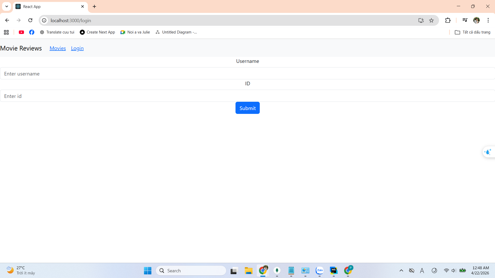
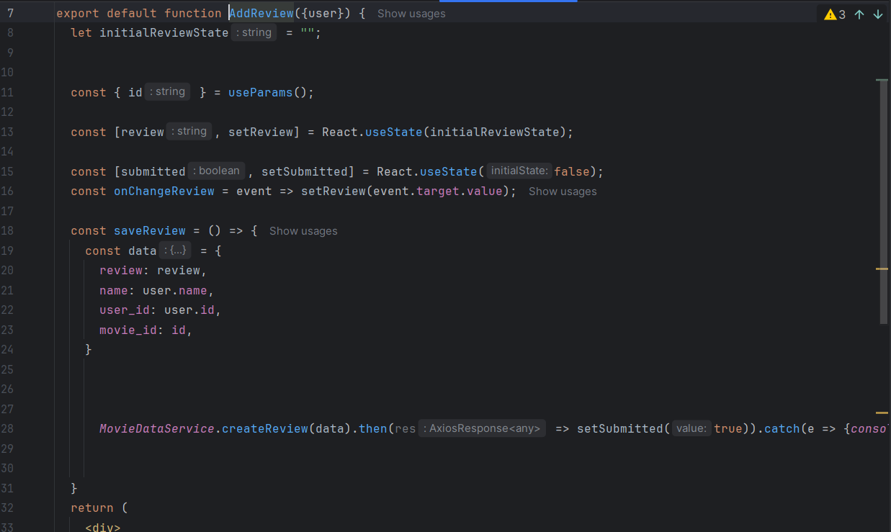
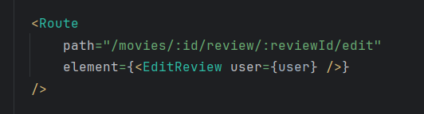
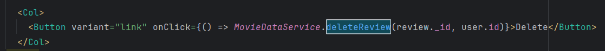
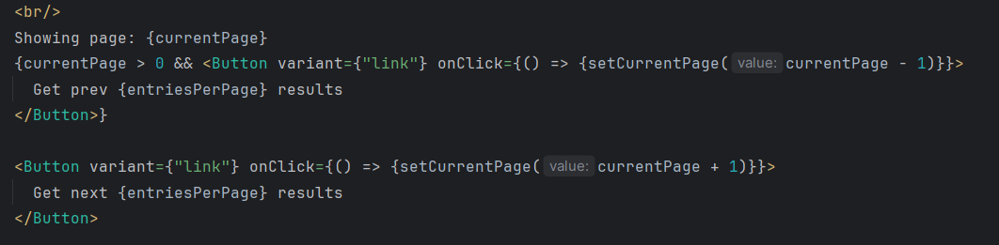
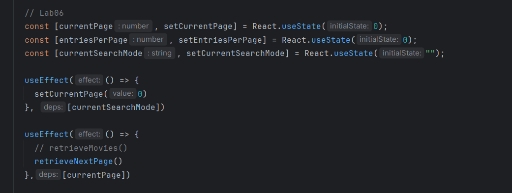
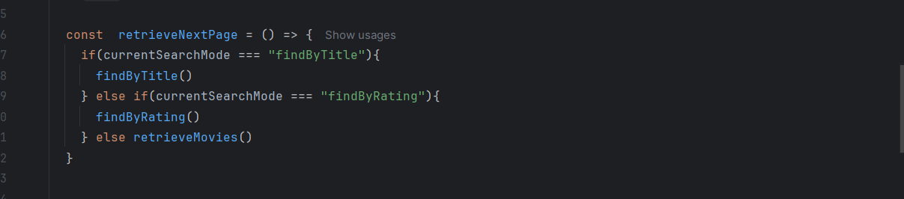
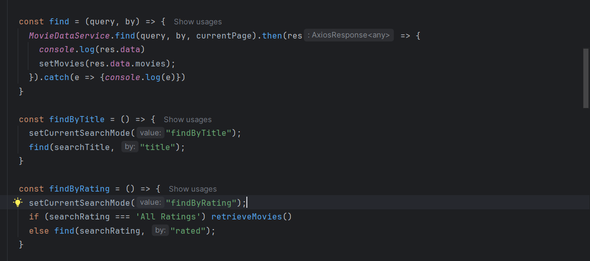
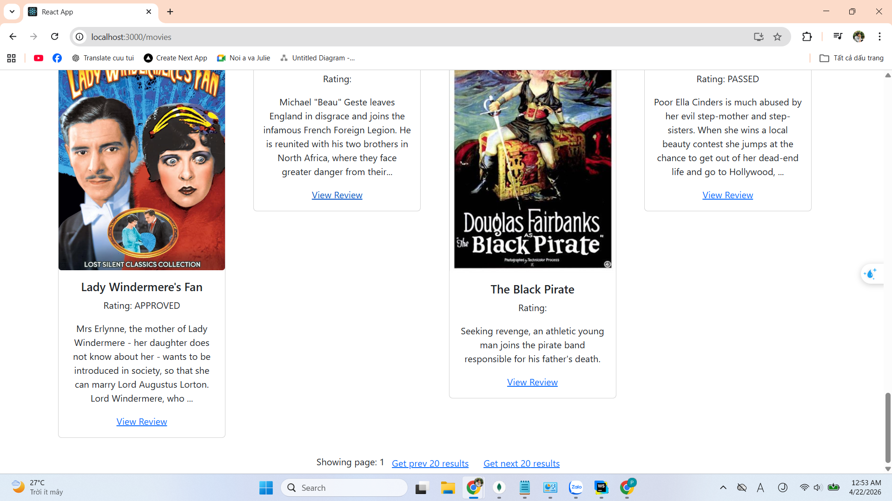

# Hướng dẫn Bài Thực Hành 6: Xây dựng Frontend với ReactJS (Tiếp theo)

## 📋 Mục tiêu bài thực hành

1. Thêm và sửa Review
2. Xóa Review
3. Lấy dữ liệu cho trang tiếp theo (Pagination)

---

## 🛠️ Công cụ / Môi trường sử dụng

- **Trình soạn thảo:** WebStorm (hoặc VS Code)
- **Package Manager:** npm
- **Thư viện chính:** React, Axios, React-Bootstrap
- **Backend:** Node.js/Express (localhost:80)

---

## 📝 Chi tiết bài làm

### Bài 1: Thêm và Sửa Review

#### 1.1 Tạo Login Component

**Yêu cầu:**
- Khi người dùng đăng nhập thành công, họ sẽ thấy được các chức năng Edit và Delete review của chính họ
- Sau khi login thành công, redirect về lại trang Home

**Cài đặt trong login.js:**

```javascript
import React, { useState } from 'react';
import Form from 'react-bootstrap/Form';
import Button from 'react-bootstrap/Button';

const Login = props => {
  const [name, setName] = useState("");
  const [id, setId] = useState("");

  const onChangeName = e => {
    const name = e.target.value;
    setName(name);
  };

  const onChangeId = e => {
    const id = e.target.value;
    setId(id);
  };

  const login = () => {
    props.login({ name: name, id: id });
    props.history.push('/');
  };

  return (
    <div>
      <Form>
        <Form.Group>
          <Form.Label>Username</Form.Label>
          <Form.Control
            type="text"
            placeholder="Enter username"
            value={name}
            onChange={onChangeName}
          />
        </Form.Group>

        <Form.Group>
          <Form.Label>ID</Form.Label>
          <Form.Control
            type="text"
            placeholder="Enter id"
            value={id}
            onChange={onChangeId}
          />
        </Form.Group>

        <Button variant="primary" onClick={login}>
          Submit
        </Button>
      </Form>
    </div>
  );
};

export default Login;
```

**Thêm Route trong App.js:**

```jsx
<Route path="/login" render={(props) =>
  <Login {...props} login={login} />
}>
</Route>
```



---

#### 1.2 Thêm Review

**Các biến trạng thái cần thiết:**

```javascript
let editing = false;
let initialReviewState = "";

const [review, setReview] = useState(initialReviewState);
const [submitted, setSubmitted] = useState(false);
```

**Xử lý thay đổi input:**

```javascript
const onChangeReview = e => {
  const review = e.target.value;
  setReview(review);
};
```

**Lưu Review:**

```javascript
const saveReview = () => {
  var data = {
    review: review,
    name: props.user.name,
    user_id: props.user.id,
    movie_id: props.match.params.id // Lấy movie id từ URL
  };

  MovieDataService.createReview(data)
    .then(response => {
      setSubmitted(true);
    })
    .catch(e => {
      console.log(e);
    });
};
```

**Hiển thị Form:**

```jsx
return (
  <div>
    {submitted ? (
      <div>
        <h4>Review submitted successfully</h4>
        <Link to={"/movies/" + props.match.params.id}>
          Back to Movie
        </Link>
      </div>
    ) : (
      <Form>
        <Form.Group>
          <Form.Label>
            {editing ? "Edit" : "Create"} Review
          </Form.Label>
          <Form.Control
            type="text"
            required
            value={review}
            onChange={onChangeReview}
          />
        </Form.Group>

        <Button 
          variant="primary" 
          onClick={saveReview}
        >
          Submit
        </Button>
      </Form>
    )}
  </div>
);
```



**📸 Kết quả Bài 1.2:** Form thêm review được hiển thị, người dùng có thể nhập và submit

---

#### 1.3 Sửa Review

**Kiểm tra trạng thái editing:**

```javascript
const AddReview = props => {
  let editing = false;
  let initialReviewState = "";

  // Kiểm tra nếu có state được truyền vào chứa currentReview
  if (props.location.state && props.location.state.currentReview) {
    editing = true;
    initialReviewState = props.location.state.currentReview.review;
  }

  const [review, setReview] = useState(initialReviewState);
  const [submitted, setSubmitted] = useState(false);
```

**Xử lý lưu Review (Create hoặc Update):**

```javascript
const saveReview = () => {
  var data = {
    review: review,
    name: props.user.name,
    user_id: props.user.id,
    movie_id: props.match.params.id
  };

  if (editing) {
    // Lấy review_id từ currentReview
    data.review_id = props.location.state.currentReview._id;
    
    MovieDataService.updateReview(data)
      .then(response => {
        setSubmitted(true);
        console.log(response.data);
      })
      .catch(e => {
        console.log(e);
      });
  } else {
    MovieDataService.createReview(data)
      .then(response => {
        setSubmitted(true);
      })
      .catch(e => {
        console.log(e);
      });
  }
};
```

**Backend sẽ gọi:**
- `apiPostReview()` khi tạo review mới
- `apiUpdateReview()` khi cập nhật review



**📸 Kết quả Bài 1.3:** Có thể chỉnh sửa review đã tạo trước đó

---

### Bài 2: Xóa Review

**Thêm nút Delete vào movie.js:**

```jsx
<Col>
  <Button 
    variant="link" 
    onClick={() => deleteReview(review._id, index)}
  >
    Delete
  </Button>
</Col>
```

**Hiện thực phương thức deleteReview:**

```javascript
const deleteReview = (reviewId, index) => {
  MovieDataService.deleteReview(reviewId, props.user.id)
    .then(response => {
      setMovie((prevState) => {
        prevState.reviews.splice(index, 1);
        return({ ...prevState });
      });
    })
    .catch(e => {
      console.log(e);
    });
};
```

**Quy trình:**
1. Truyền review ID và index vào hàm deleteReview()
2. Gọi `MovieDataService.deleteReview()` 
3. Sau khi xóa thành công, lấy mảng reviews hiện tại
4. Dùng `splice()` để xóa review tại index đó
5. Cập nhật lại state với mảng reviews mới



**📸 Kết quả Bài 2:** Có thể xóa review của chính mình


---

### Bài 3: Lấy dữ liệu cho trang tiếp theo (Pagination)

#### 3.1 Hiện thực getAll() với Pagination

**Tạo biến trạng thái:**

```javascript
const [movies, setMovies] = useState([]);
const [searchTitle, setSearchTitle] = useState("");
const [searchRating, setSearchRating] = useState("");
const [ratings, setRatings] = useState(["All Ratings"]);
const [currentPage, setCurrentPage] = useState(0);
const [entriesPerPage, setEntriesPerPage] = useState(0);
```

**Thêm useEffect để theo dõi thay đổi trang:**

```javascript
useEffect(() => {
  retrieveMovies();
  retrieveRatings();
}, []);

useEffect(() => {
  retrieveMovies();
}, [currentPage]);
```

**Lấy dữ liệu phim:**

```javascript
const retrieveMovies = () => {
  MovieDataService.getAll(currentPage)
    .then(response => {
      console.log(response.data);
      setMovies(response.data.movies);
      setCurrentPage(response.data.page);
      setEntriesPerPage(response.data.entries_per_page);
    })
    .catch(e => {
      console.log(e);
    });
};
```

**Hiển thị phân trang:**

```jsx
<br />
Showing page: {currentPage}.
<Button
  variant="link"
  onClick={() => {setCurrentPage(currentPage + 1)}}
>
  Get next {entriesPerPage} results
</Button>
```





**📸 Kết quả Bài 3.1:** Có thể chuyển trang để xem các phim tiếp theo

---

#### 3.2 Hiện thực find() với Pagination

**Tạo biến theo dõi chế độ tìm kiếm:**

```javascript
const [currentSearchMode, setCurrentSearchMode] = useState("");
```

**Thêm useEffect để reset trang khi thay đổi chế độ tìm:**

```javascript
useEffect(() => {
  setCurrentPage(0);
}, [currentSearchMode]);

useEffect(() => {
  retrieveNextPage();
}, [currentPage]);
```

**Tạo hàm để xử lý chuyển trang:**

```javascript
const retrieveNextPage = () => {
  if(currentSearchMode === "findByTitle")
    findByTitle();
  else if(currentSearchMode === "findByRating")
    findByRating();
  else
    retrieveMovies();
};
```

**Cập nhật hàm find():**

```javascript
const find = (query, by) => {
  MovieDataService.find(query, by, currentPage)
    .then(response => {
      console.log(response.data);
      setMovies(response.data.movies);
    })
    .catch(e => {
      console.log(e);
    });
};
```

**Cập nhật các hàm tìm kiếm:**

```javascript
const retrieveMovies = () => {
  setCurrentSearchMode("");
  MovieDataService.getAll(currentPage)
    .then(response => {
      console.log(response.data);
      setMovies(response.data.movies);
      setCurrentPage(response.data.page);
      setEntriesPerPage(response.data.entries_per_page);
    })
    .catch(e => {
      console.log(e);
    });
};

const findByTitle = () => {
  setCurrentSearchMode("findByTitle");
  find(searchTitle, "title");
};

const findByRating = () => {
  setCurrentSearchMode("findByRating");
  if(searchRating === "All Ratings") {
    retrieveMovies();
  } else {
    find(searchRating, "rated");
  }
};
```





**📸 Kết quả Bài 3.2:** Có thể tìm kiếm và chuyển trang kết quả



---

## 🎯 Tóm tắt công nghệ sử dụng

| Công nghệ | Mục đích |
|-----------|---------|
| **React State** | Quản lý các trạng thái: review, submitted, currentPage, etc. |
| **React Hooks** | useState, useEffect để xử lý state và side effects |
| **React Router** | Điều hướng và truyền state giữa components |
| **Axios** | Gửi HTTP requests tới backend API |
| **React-Bootstrap** | Component Form, Button, Col, Row |

---

## 🔑 Các khái niệm chính

### 1. Editing Mode
- Sử dụng flag `editing` để xác định component đang ở chế độ thêm hay sửa
- Kiểm tra `props.location.state.currentReview` để xác định có dữ liệu cũ

### 2. State Management
- `review`: nội dung review hiện tại
- `submitted`: theo dõi xem review đã được submit hay chưa
- `currentPage`: trang hiện tại
- `currentSearchMode`: chế độ tìm kiếm hiện tại

### 3. Conditional Rendering
- Hiển thị form hoặc thông báo thành công tùy thuộc vào `submitted`
- Hiển thị "Create" hoặc "Edit" label tùy thuộc vào `editing`

### 4. Array Manipulation
- Sử dụng `splice()` để xóa phần tử khỏi mảng
- Sử dụng spread operator `{...prevState}` để tạo object mới

### 5. Pagination Pattern
- Gửi `currentPage` trong API request
- Update state khi response trả về page mới
- Trigger `retrieveNextPage()` khi `currentPage` thay đổi

---

## ✅ Checklist hoàn thành

- [ ] Tạo Login Component và xử lý đăng nhập
- [ ] Hiện thực chức năng thêm review
- [ ] Hiện thực chức năng sửa review (edit mode)
- [ ] Hiện thực chức năng xóa review
- [ ] Thêm pagination cho danh sách phim
- [ ] Xử lý pagination khi tìm kiếm
- [ ] Kiểm tra tất cả chức năng hoạt động đúng

---

## 📚 Tham khảo thêm

- [React State and Lifecycle](https://react.dev/learn/state-a-component-memory)
- [React Router Documentation](https://reactrouter.com/)
- [Axios Documentation](https://axios-http.com/)
- [React-Bootstrap Components](https://react-bootstrap.github.io/)
- [Array Methods - splice()](https://developer.mozilla.org/en-US/docs/Web/JavaScript/Reference/Global_Objects/Array/splice)